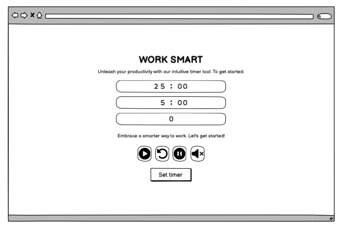
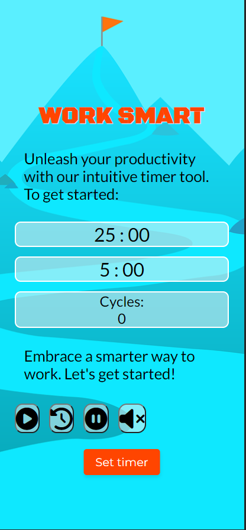

# WorkSmart: Your Pomodoro Productivity Booster

## WireFrames
- 
- 
- 

- Hover over buttons
- 
- 
- 
- 

- Set timer when clicked
- 
- 
- 

- Hover over Timer settings
- 

- Hover over input number
- 

- Pulse fuctions
- 
- 

## Testing
- W3C test for HTML
- 

- W3C test for CSS
- 

- JShint test for JavaScript
- 

- Lighthouse test
- 

## Features
- Screenshot of Page
- 

- 

- Favicon
- 

- 

* Customizable Timer: Set custom durations for your work and break sessions.
* Sound Notifications: Get audible cues to start your break or return to work. (With mute option available)
* Cycles Counter: Track and set the number of Pomodoro cycles.
* Interactive UI: The timer pulses in green during active sessions.
* Session Control: Easily start, pause, or reset your session with intuitive buttons.
* Input Validation: Ensures users only enter valid time values.

## Description

WorkSmart is an intuitive Pomodoro timer designed to enhance your productivity. With this clean and stylish design, you can focus on your tasks, take structured breaks, and boost your efficiency, whether it's for work, studies, or workout sessions.

## HTML Overview
The `WorkSmart` webpage is a responsive and intuitive Pomodoro timer tool designed to boost productivity. It's perfect for work, study, and training sessions.

## Features

### Meta Data
- SEO optimized with `description` and `keywords` tags.
- Responsive design supported by the viewport meta tag.

### Assets
- Integration with [FontAwesome](https://fontawesome.com/) for icons.
- Custom favicons for various devices and platforms.
- External stylesheet for easy customization located at `./assets/css/style.css`.

### Main Timer Components
- A primary timer display set to 25 minutes by default.
- A break timer display set to 5 minutes by default.
- A cycles counter to track the number of Pomodoro sessions.

### User Controls
- Start, reset, pause, and mute buttons with accessible labels.
- Tooltips for added user guidance.
- Session configuration options to customize work, break durations, and set the number of cycles.

### Additional Resources
- JavaScript functionality provided by the external script `./assets/js/script.js`.

## CSS Styling Overview

### Fonts
- Uses custom fonts from Google Fonts including 'Black Ops One', 'Lato', and 'Montserrat'.

### Base Styles
- Resets default margin, padding and sets the universal box-sizing.
- Default font families are 'Lato' and 'Montserrat'.

### Body & Layout
- Uses flexbox for center alignment and background styling.

### Timer Display
- Includes styles for work, break, and cycle timers with responsive font sizes and alignment.
- Pulse animations for active timers and cycles.
- Special animation for mute functionality.

### Controls & Settings
- Flexbox designs for control buttons and timer settings.
- Hover, active, and focus effects for buttons and input fields.
- Tooltip feature for additional information.

### Labels & Text
- Styling for the workout label, including font properties and shadow.

### Responsive Styles
- Media queries ensure the design is responsive across devices. 
  - Adjustments are made for screens less than 1024px, 768px, and 480px in width.
  - Includes reordering and resizing elements for smaller screens.

### Tooltips
- Positioning and hover effects to display helpful tooltips.

## JavaScript Functionality Overview

### Initialization & References
- Initializes references to buttons, time displays, and input fields.

### Audio Feedback
- Plays an audio effect during interactions with an option to mute.

### Cycles Management
- Allows users to set the desired number of timer cycles.
- Provides visual feedback upon cycle count changes.

### Timer Control
- Offers start, pause, or reset functions for the timer.
- Transitions between work and break timers.
- Alerts the user upon completion of all set cycles.

### Timer Display & Settings
- Active timers visually pulse for clear indication.
- Users can adjust default timer durations.
- Ensures input values are validated for seamless operation.

### UI Interactions
- Provides a toggle feature for timer settings visibility.
- Visual feedback is given during various setting changes.

## Deployment Guide 

Want to see the live version of our project? We've made it super easy for you to access and test the website even during its development phase. Follow this step-by-step guide to understand how the webpage was deployed on GitHub:

1. **Access the Repository**:  
   Simply click on this [link](https://github.com/Klurifixus/projectPT2) to open our project's GitHub repository.

2. **Go to Settings**:  
   Once you're inside the repository, navigate to the top of the page. You'll see a tab labeled "Settings". Click on it.

3. **Find the 'Pages' Tab**:  
   On the left sidebar inside Settings, there's a tab called "Pages". Click on it.

4. **Deployment Settings**:  
   Here, you can choose to deploy from a specific branch. In our case, we used the main branch. After selecting, click "Save".

5. **Access the Live Site**:  
   After a short wait, you can find the link to the live website on the right sidebar of the repository, under the section labeled "Deployments". Or you can simply click on this [projectPT2](https://klurifixus.github.io/projectPT2/) link to visit our live site!

Happy browsing!

## Usage

1. Open the tool and by default, you will see a timer set for 25 minutes (work session) and 5 minutes (break session).
2. Click the "Set timer" button to customize the work and break durations.
3. Adjust the number of cycles if required.
4. Click the "Start" button to begin the timer.
5. When the work timer expires, the break timer starts automatically.
6. Use the "Pause" and "Reset" buttons as needed.
7. The mute button can be toggled to silence notifications.

## Conclusion and Acknowledgments

This project was both a journey and a significant personal challenge. What began as a vision for a spin-wheel took an unexpected turn when I stumble upon a Pomodoro clock on [YouTube](https://www.youtube.com/watch?v=vAEG6OVCass&list=PLw5h0DiJ-9PAtGd3QOzUOX6aDUkeS2Qg1). This inspiration led me to pivot my focus, driven by the utility such a tool would offer in my day-to-day life.

Throughout the developmental stages, there were moments of clarity, mixed with phases of trial and error. I frequently reconstructed the project from the ground up, driven by the pursuit of perfection. One of the crucial takeaways from this endeavor was the importance of stepping back to reassess when faced with challenges, rather than being mired in a cycle of continuous rectifications.

Leveraging platforms like Codepen was invaluable, allowing me to visualize changes holistically before integrating them. Moreover, as I delved deeper into the complexities of JavaScript, I recognized the vast potential it offers, even though the learning curve was steep.

The absence of guidance from my mentor, coupled with limited assistance from peers, meant I leaned heavily on digital resources. Tools like Genie, Codepen, jshint, w3c, and even Chat GDP, became instrumental in navigating challenges, be it for specific effects, bug checks, or simple typos.

While my prowess in HTML and CSS solidified, JavaScript remained a realm I am eager to master further. Reflecting on this project, my comprehension of coding languages has grown exponentially, yet the path to mastery is long and winding.

An oversight I regret is the delay in documenting my journey in this README. The intensity of the coding process, at times, overshadowed the importance of effective documentation. However, the realization dawned just as the project neared its deadline. The learning here is clear: balancing coding with comprehensive documentation is vital.

In closing, I'm genuinely proud of what I've accomplished. The hurdles and the triumphs of this project are reminders of both my progress and the areas ripe for further growth. Every challenge faced and every line of code written has invaluably contributed to my journey as a developer.

## Future Features
1. **Notifications**: Integrate browser notifications or alerts when the timer or break is over.
2. **Dark Mode**: Allow users to toggle between light and dark modes.
3. **Statistics**: Provide insights into the user's productivity. For instance, track the number of cycles completed in a day.
4. **Background Themes**: Allow users to customize the background with various themes or even personal images.
5. **Sound Options**: Offer multiple sound alerts to choose from.
6. **Mobile App**: Develop a companion mobile app to allow users to use the timer on-the-go.
7. **Sync Across Devices**: Allow users to sync their timer settings and statistics across devices.
8. **Task Integration**: Allow users to list out tasks they want to complete within the cycles.
9. **Leaderboard**: Implement a leaderboard to foster a community and challenge where users can compete based on productivity metrics.
10. **Extensions**: Develop browser extensions for popular browsers for easier access to the timer.

## Known Bugs
1. **Responsiveness**: The app may not be fully optimized for all mobile devices.
2. **Sound Overlap**: If the start button is clicked multiple times in succession, the sound might overlap.
3. **Timer Continuity**: If the user changes the tab or focuses on another application, the timer might pause or become erratic on some browsers.
4. **Input Validation**: The application currently does not handle negative numbers or non-integer inputs gracefully.
5. **Mute Toggle**: If muted during an ongoing alert, the sound doesn't stop immediately.

## Tools and Programs Used

1. **VS Code**: A powerful source code editor developed by Microsoft. I used it as the primary environment for writing and organizing my code.

2. **Balsamiq**: A wireframing tool that allows for quick mockups of user interfaces. I utilized Balsamiq to visualize and plan the project's interface.

3. **CodePen**: An online code editor and community for frontend developers. It was helpful for testing isolated pieces of code and viewing results in real-time.

4. **Prettier**: An opinionated code formatter that ensures code adheres to consistent style standards, making the codebase more readable and maintainable.

5. **Genie**: A tool for debugging and inspecting code. Genie assisted in pinpointing issues and optimizing the project.

6. **CI-Full-Template**: A Continuous Integration template. It ensured that each code push or pull request was automatically tested, ensuring the integrity of the project.

7. **ChatGPT**: An advanced conversational AI. I consulted ChatGPT for guidance on specific coding challenges and for obtaining clarifications.

8. **JSHint**: A static code analysis tool for JavaScript. It helped in detecting errors and potential problems in the JavaScript code.

9. **W3C for HTML & CSS**: The World Wide Web Consortium's validators for HTML and CSS ensured that the project's markup and stylesheets adhered to web standards.

10. **Chrome DevTools**: A set of web developer tools built directly into the Google Chrome browser. I used the DevTools, especially the responsiveness viewer, to ensure the project looked and worked well on various device sizes.

11. **Lighthouse**: An open-source, automated tool for improving the quality of web pages. It provided insights into performance, accessibility, and other best practices.

12. **YouTube Tutorials**: I leveraged various YouTube tutorials to gain insights, techniques, and best practices related to specific project challenges.

13. **Udemy Courses**: Online courses on Udemy provided deeper dives into certain topics, offering structured lessons and projects that further enhanced my skills.

14. **Google Search Engine**: An invaluable resource for any developer. I frequently used Google to find solutions to challenges, explore documentation, and access a wide range of development resources.

15. **FontAwesome**: A comprehensive library of vector icons that can be customized and embedded in projects. I used FontAwesome to enhance the user interface of the project, providing visually appealing and recognizable icons.

16. **Favicon**: Favicons are the small icons that appear in browser tabs, bookmark bars, and other user interface components. For this project, I designed a unique favicon to represent the application and make it easily identifiable among other browser tabs.

17. **Pixabay**: for free images and sound.

## Contributions

If you'd like to contribute to this project, please create a fork and submit a pull request. Any contributions, whether it's fixing bugs, improving documentation, or suggesting new features, are welcome!

## WorkSmart License Agreement

### Preamble
This License applies to the WorkSmart project (the "Software"), a Pomodoro Timer application created as a school project. This license allows you to use, modify, and distribute the Software in its original or modified form. Please read the following terms and conditions before using, modifying, or distributing this Software.

### Terms and Conditions
1. Definition. "Software" refers to the WorkSmart project, including its code, assets, documentation, and all associated files.

2. Grant of License. Subject to the terms and conditions of this License, the author hereby grants you a free, perpetual, worldwide, non-exclusive, no-charge, royalty-free, irrevocable license to use, modify, and distribute the Software.

3. Acknowledgement. While not required, you are encouraged to give credit to the original author when using or redistributing the Software.

4. Attribution of Assets. The background images and sound effects used in the Software are sourced from Pixabay and are free for commercial and non-commercial use. If you use these assets separately from the Software, you must adhere to Pixabay's terms of service and give appropriate credit.

5. Limitation of Liability. The Software is provided "as is", without warranty of any kind, express or implied, including but not limited to the warranties of merchantability, fitness for a particular purpose, and non-infringement. In no event shall the author or copyright holder be liable for any claim, damages, or other liability, whether in an action of contract, tort or otherwise, arising from, out of, or in connection with the Software or the use or other dealings in the Software.

6. Termination. This License will continue in full force and effect unless terminated earlier pursuant to this clause. If you breach this License and fail to cure such breach within 30 days from the date of written notice of such breach, this License will terminate automatically.

7. Governing Law. This License is governed by the laws of the jurisdiction in which the original author resides.

8. Entire Agreement. This License constitutes the entire agreement between you and the author relating to the Software and supersedes all prior understandings, communications, or agreements, written or oral, relating to its subject matter.

## Contact

- Name: [Pierre Nilsson]
- Email: [pirrefixus@gmail.com]

## Credits, Thanks, and Content Sources

- This project is inspired by [YouTube](https://www.youtube.com/watch?v=vAEG6OVCass&list=PLw5h0DiJ-9PAtGd3QOzUOX6aDUkeS2Qg1).
- A special thanks to my girlfriend for her continuous support and for watching the kids while I focused on my studies.
- Gratitude to David Calikes for his inputs, especially since I didn't have a mentor readily available prior to submission.

- 